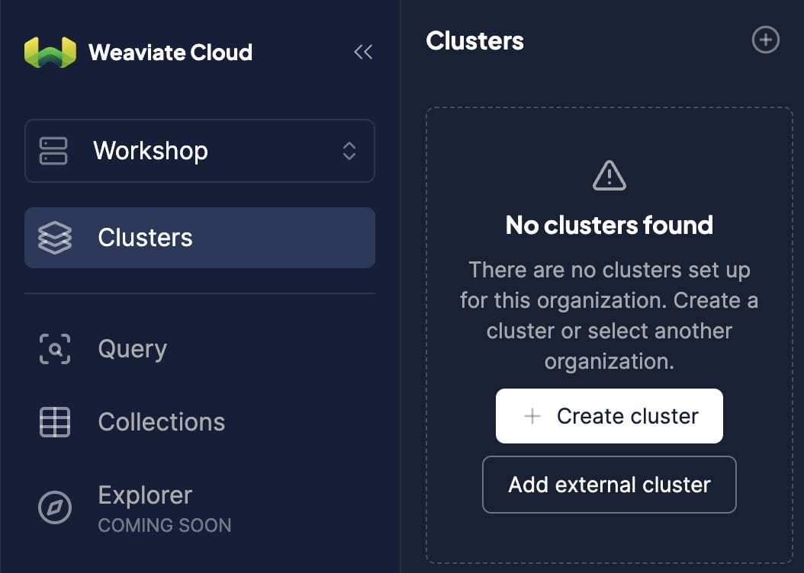
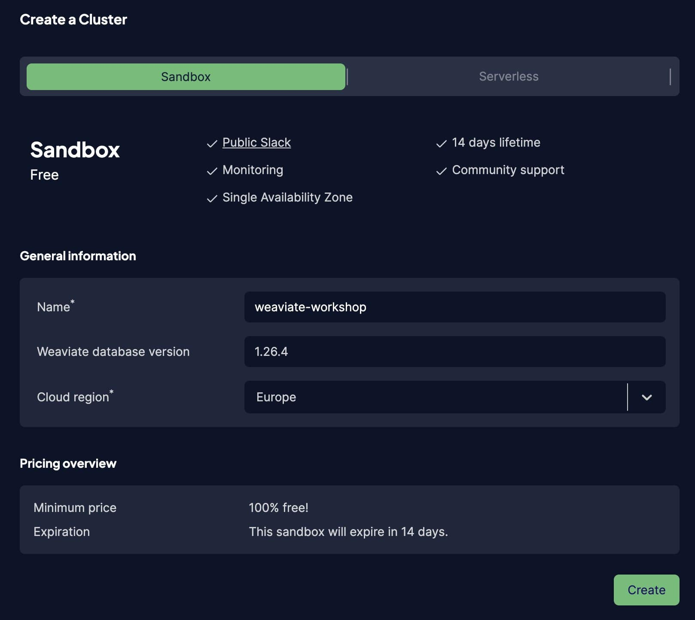

# Weaviate Workshop

## What you need for the workshop

* API Keys for embedding models, like:
  * OpenAI - [API keys](https://platform.openai.com/settings/profile?tab=api-keys)
  * etc,

## Create a Weaviate Cloud instance

  * Head to [Weaviate Cloud console](https://console.weaviate.cloud/) and log in, or create a new account.
  * Create a free `Sandbox` cluster. Give it a name, select the cloud region and press "Create".




## Running the workshop

You can follow this workshop using:
- a [local Devcontainer](#local-devcontainer-setup)
- [GitHub Codespaces](#github-codespaces-setup)

We recommend using the local Devcontainer, as you will not be limited by the resources of the Codespaces environment, or your Internet connection.

As another option, you can also run the code on your local machine using your preferred environment manager and package manager. This is not covered in the README.

### Local Devcontainer setup

#### Prerequisites

- Install VSCode (https://code.visualstudio.com/download)
- Install Docker (https://www.docker.com/products/docker-desktop/)

#### Installation

Copy this repository to your local machine:

```shell
git clone https://github.com/weaviate-tutorials/weaviate-workshop
```

Move into the directory and open it in VSCode:

```shell
cd weaviate-tutorials
code .
```

If prompted to "Reopen folder to develop in a container". Click "Reopen in Container".

If not:
- Install the "Dev Containers" extension in VSCode (by Microsoft).
- Open the command palette (Ctrl+Shift+P / Cmd+Shift+P) and type "Rebuild and Reopen in Container".

You should see a popup at the bottom right corner, indicating that the project is being reopened in a container.

When the container is ready, you should see a terminal in VSCode. It should include messages from a `pip install ...` command, and finish with a message like: `Done. Press any key to close the terminal.`

### GitHub CodeSpaces Setup

#### Prerequisites

- Log in to GitHub with your account

#### Instantiation

- Go to the project [https://github.com/weaviate-tutorials/weaviate-workshop](https://github.com/weaviate-tutorials/weaviate-workshop)

- Create a Codespace project
  * Press the green `<> Code` button, then switch to `Codespaces` tab.
  * Press the `Create codespace on main` button.

## Test your Python environment

You should be in a terminal window, with a prompt such as `/workspaces/weaviate-workshop#`

Run the following command to check that everything is running:

```shell
python check-env.py
```

You should see an output, similar to:

```shell
Python version: 3.11.11 (main, Feb 25 2025, 09:36:46) [GCC 10.2.1 20210110]
Weaviate Python Client package version: 4.11.0
```

Then, you are good to go.

If you are prompted to identify which Python interpreter to use, select the one that is in the `/usr/local/bin/python` directory. This is the Python interpreter in the container.

It will include the required packages, such as the Weaviate Python client.

## Environment variables

Update the required env vars, e.g. `WEAVIATE_URL` and `WEAVIATE_KEY` in `.env`. For example:

```shell
WEAVIATE_URL=https://<YOUR_ENDPOINT>.gcp.weaviate.cloud
WEAVIATE_KEY=some-api-key
```

Hint. you can find your Weaviate Cluster URL and API keys in the [WCD console](https://console.weaviate.cloud/).

## Test your setup

Head to [1-intro/0-prep-run.ipynb](./1-intro/0-prep-run.ipynb), and run through all steps.

## Download the pre-vectorized data

Head to [prep-data.ipynb](./prep-data.ipynb) and run all the cells. This should download the data we will use in the second lesson.
