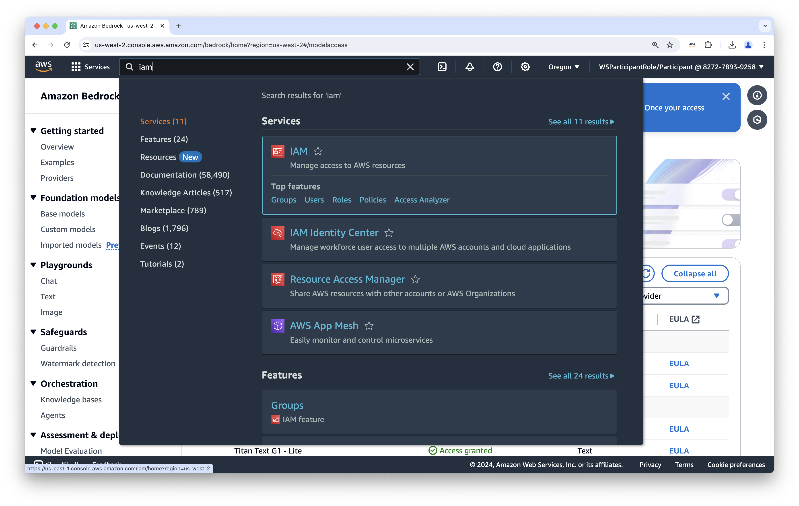
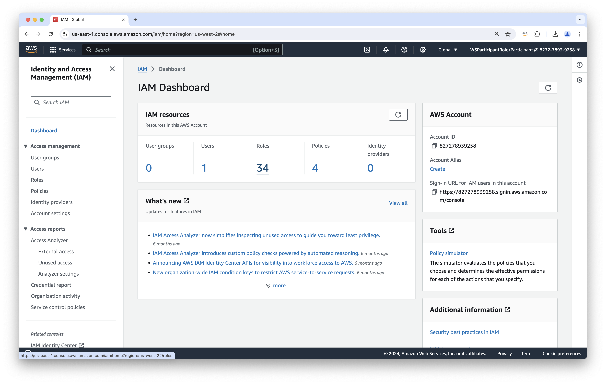
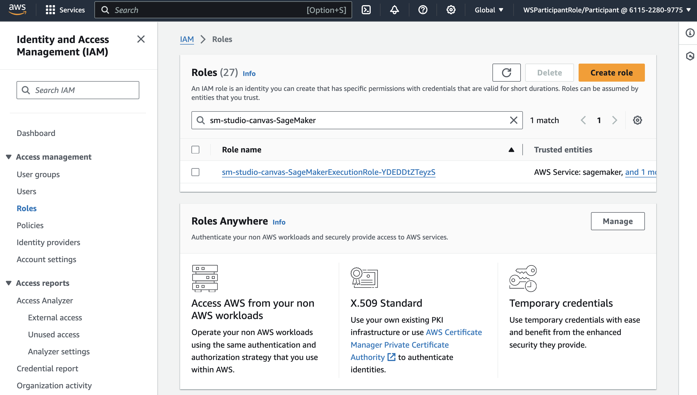
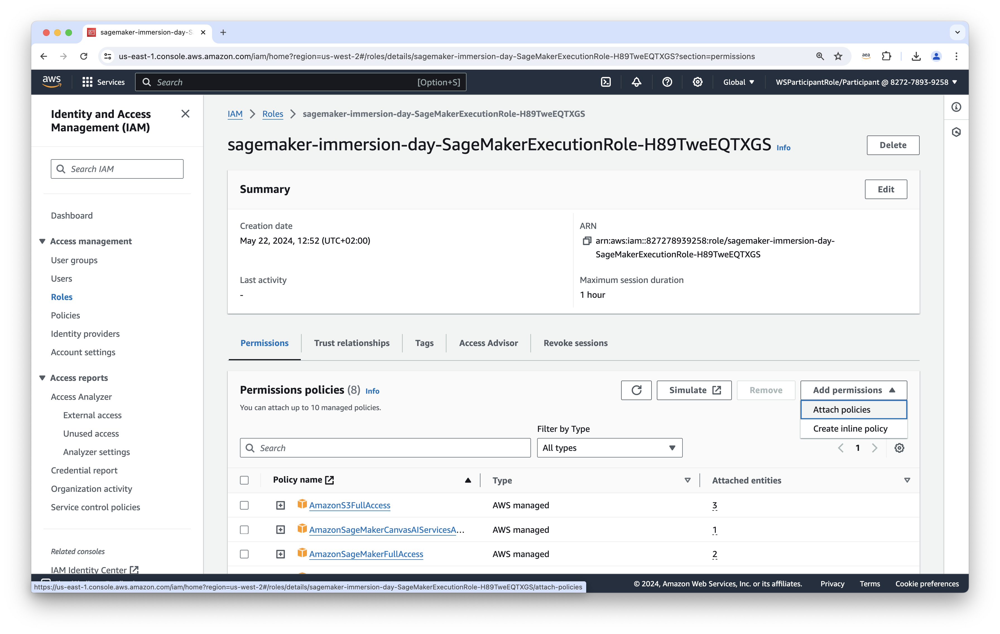
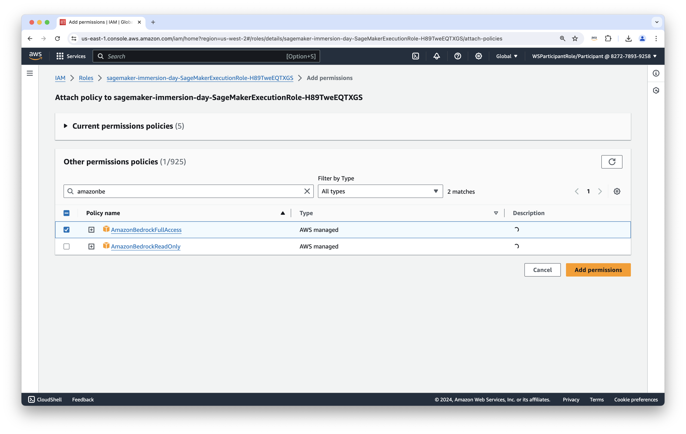
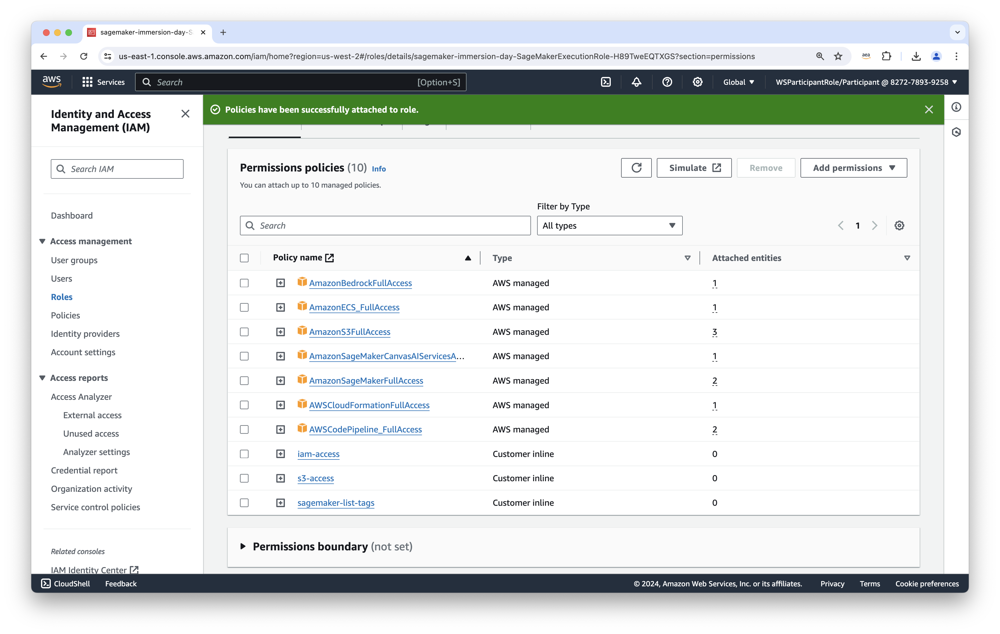
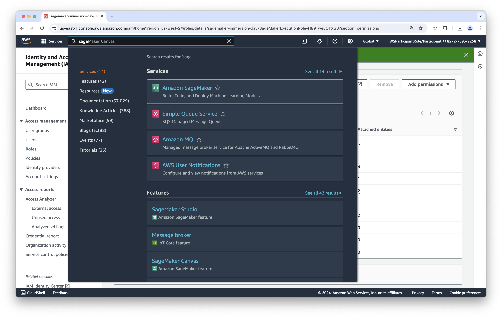
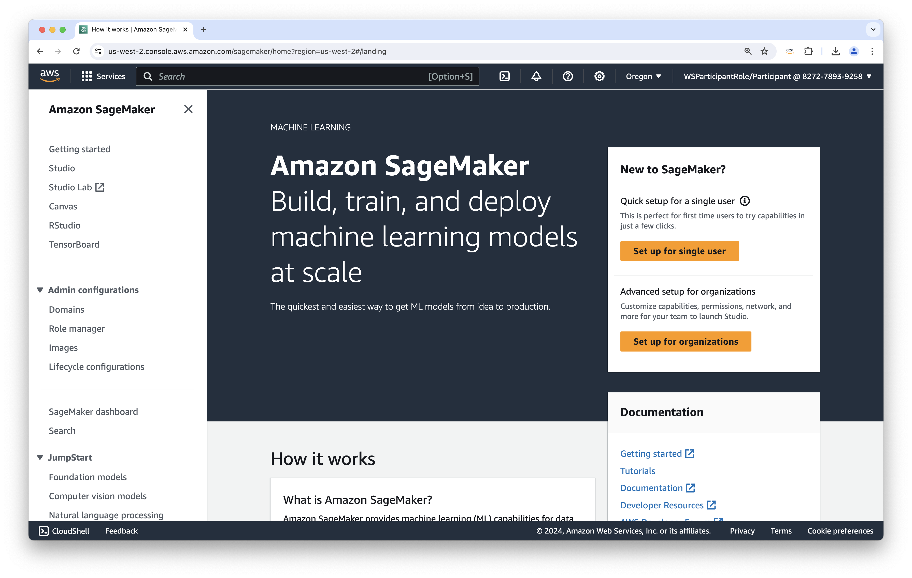
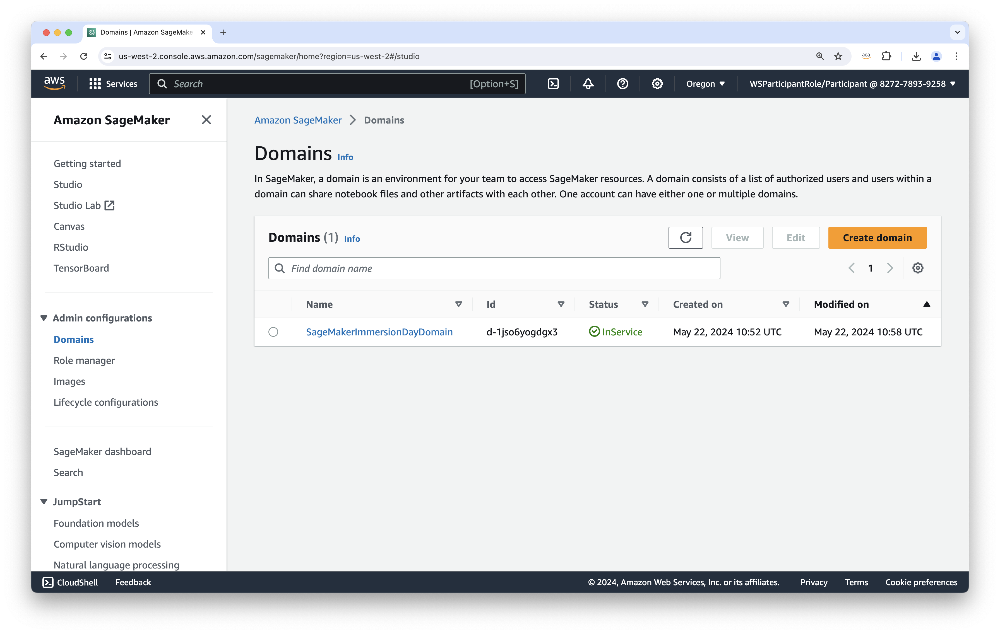
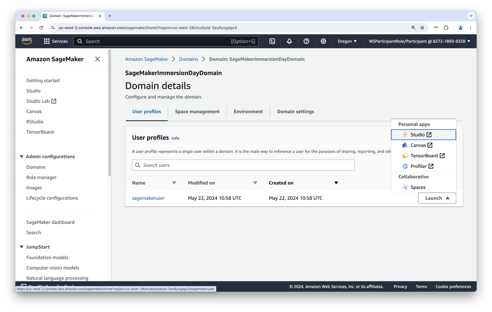

# Weaviate Workshop


## Accessing the workshop environment:

- Go to: https://catalog.us-east-1.prod.workshops.aws/join
- Enter the code shown on screen
- Open the AWS console on the bottom left corner

## Setting up Amazon Bedrock

### Open Amazon Bedrock by searching for it in the search bar


### Select the hamburger menu on the left side to open the side bar


### in the side bar select "model access"


### Select Enable specific model


### Select all models provided by Amazon 


### Scroll down till you see the next button, and select this button


### Submit the model request


## Setting up the Identity and Access Management (IAM) roles

### Search for IAM in the search bar


### Select "Roles"


### Search for the role starting with "sagemaker-immersion-day" and click on the role name, with trusted entities note "AWS Service: sagemaker"


### Select "Add permissions" and "Attach policies"


### Add the policy "AmazonBedrockFullAccess"


### Add the policy "AmazonECS_FullAccess" and select "Add permissions"


### Check that both policies are added


## Setting up Amazon SageMaker

### Search for Amazon SageMaker


### When seeing the SageMaker landing page, select Domains (under Admin configurations)


### Select the domain called "SageMakerImmersionDayDomain" by clicking on the name


### Open "Studio" under "Launch"


### Skip the tour for now


### Select JupyterLab (top left) and select "Create JupyterLab space" (top right)


### Create a new space


### Select "Run space"


### Select "Open JupyterLab" once it's ready


### Open a Terminal (under other)


Type the following:

### Clone the workshop repository
```bash
git clone -b aws-immersion https://github.com/weaviate-tutorials/weaviate-workshop
```

### Move to the setup folder
```bash
cd weaviate-workshop/0-setup/
```

### Ensure that the setup script is executable
```bash
chmod +x setup.sh
```

### Run the setup.sh script
```bash
./setup.sh
```

### Once you see the `Weaviate Endpoint Reachable at: [IP]`, copy the `[IP]` 

### Open the `1-intro` folder and paste the `[IP]` in `WEAVIATE_IP`