# Weaviate Workshop


## Accessing the workshop environment:

- Go to: https://catalog.us-east-1.prod.workshops.aws/join
- Enter the code shown on screen
- Open the AWS console on the bottom left corner

## Setting up Amazon Bedrock

### Open Amazon Bedrock by searching for it in the search bar
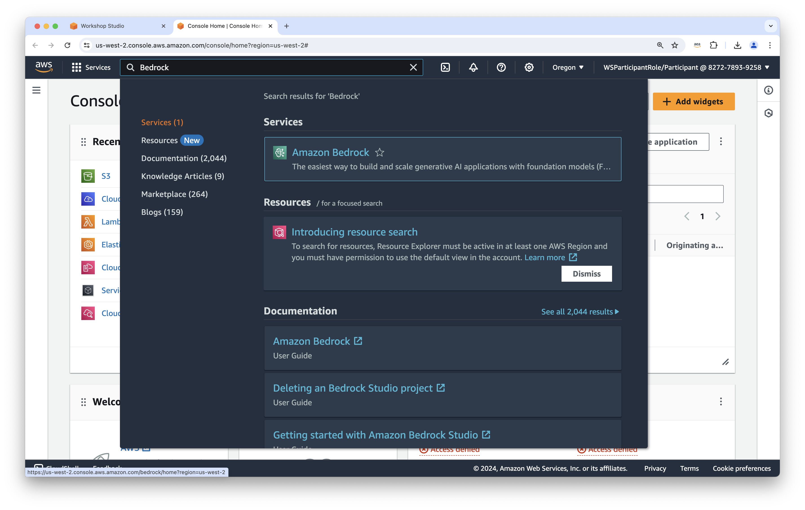

### Select the hamburger menu on the left side to open the side bar
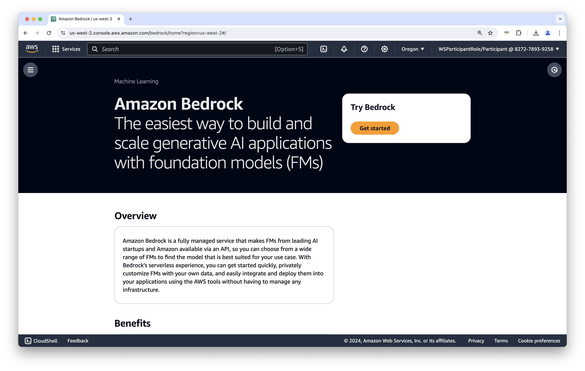

### in the side bar select "model access"
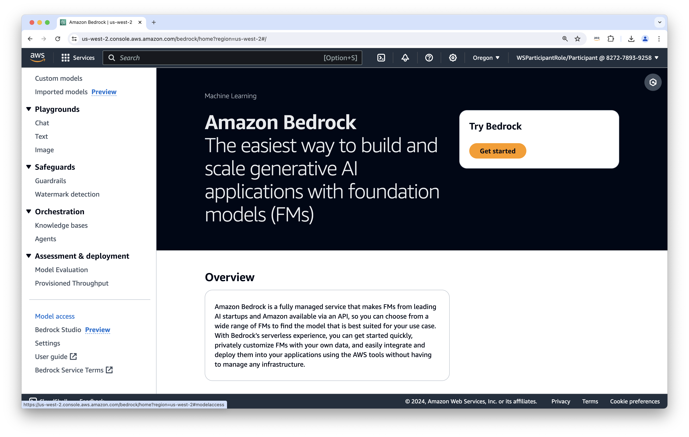

### Select Enable specific model
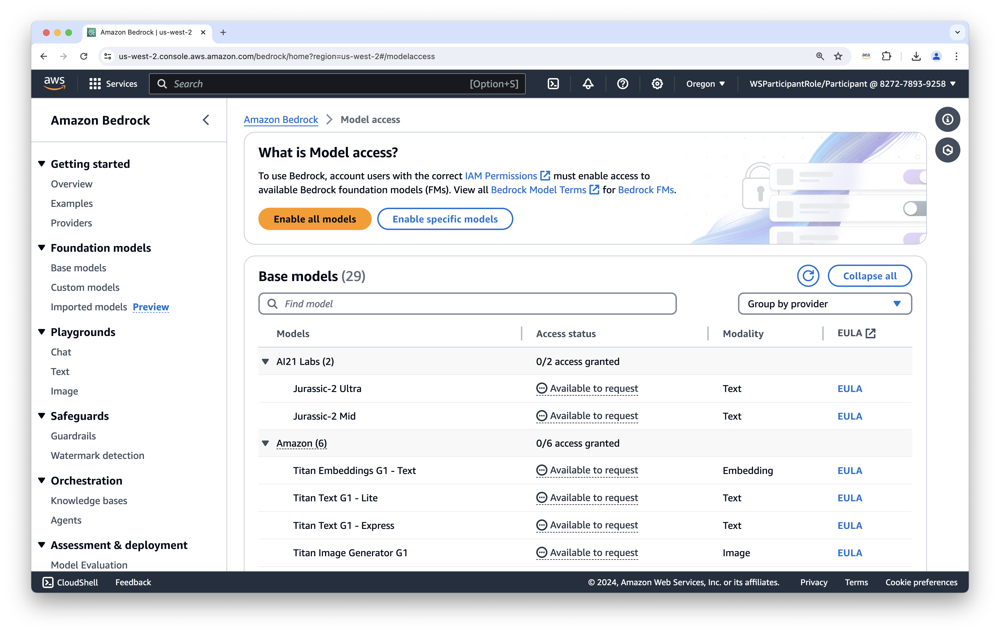

### Select all models provided by Amazon
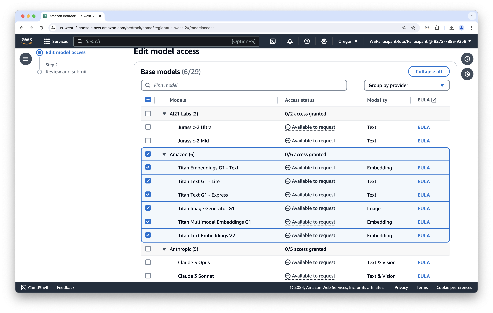

### Scroll down till you see the next button, and select this button
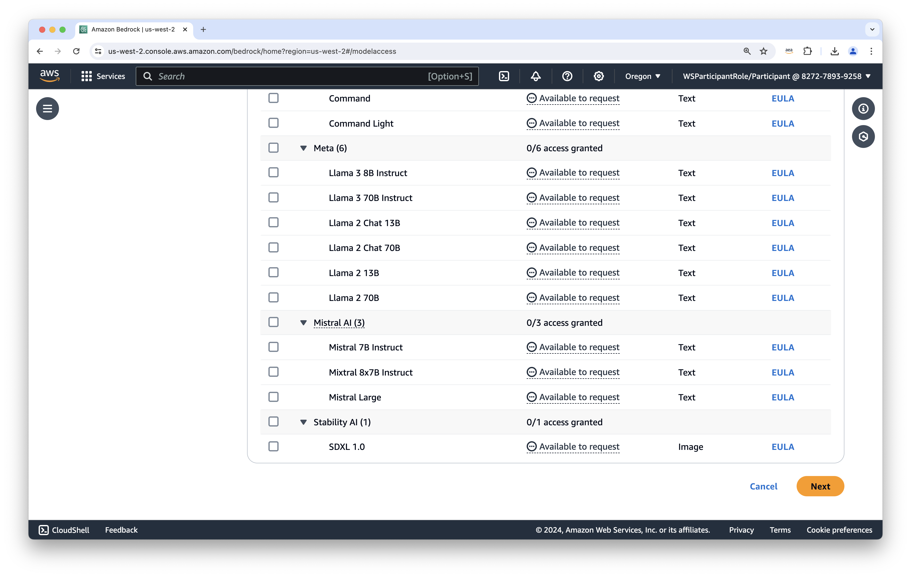

### Submit the model request
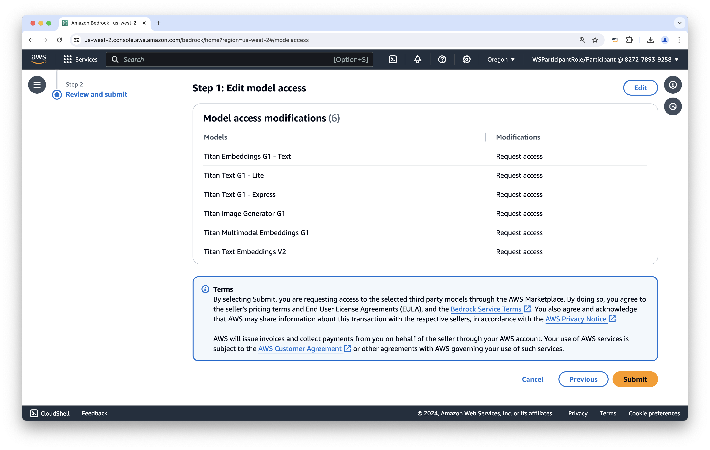

## Using Amazon SageMaker

### Skip the tour for now
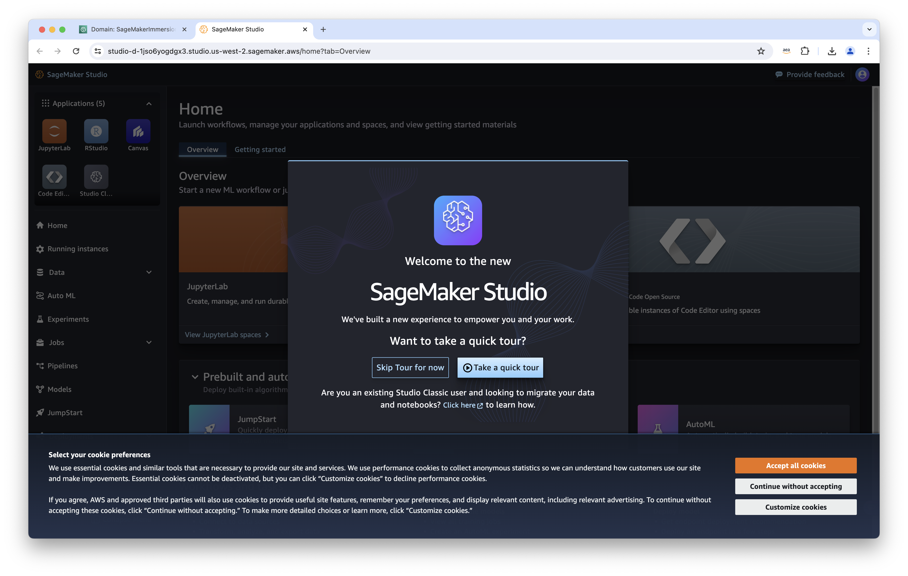

### Select JupyterLab (top left) and select "Create JupyterLab space" (top right)
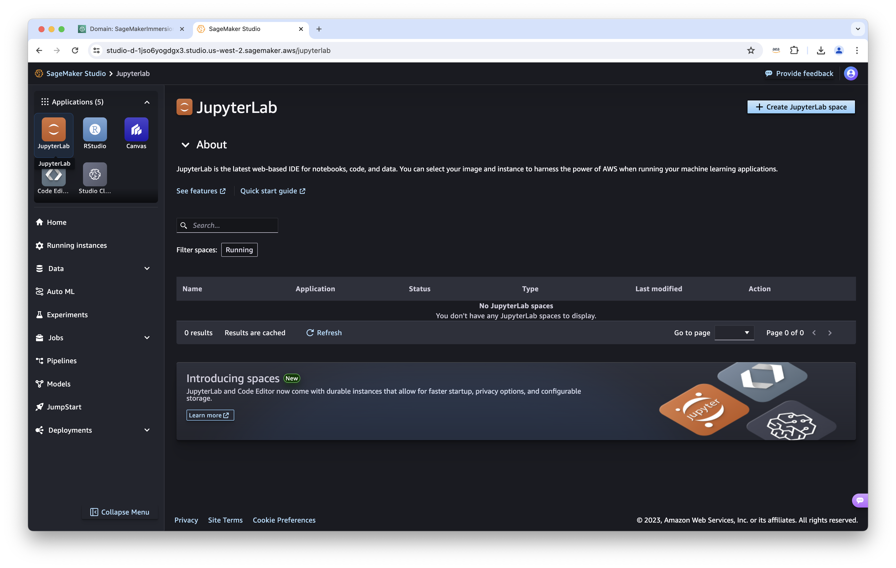

### Create a new space
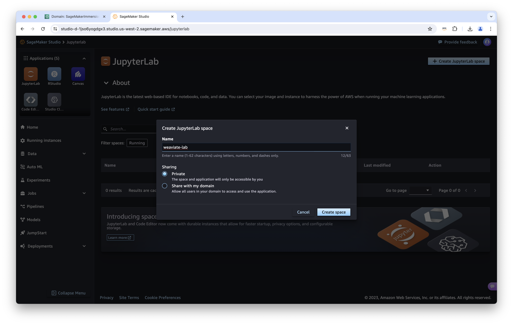

### Select "Run space"
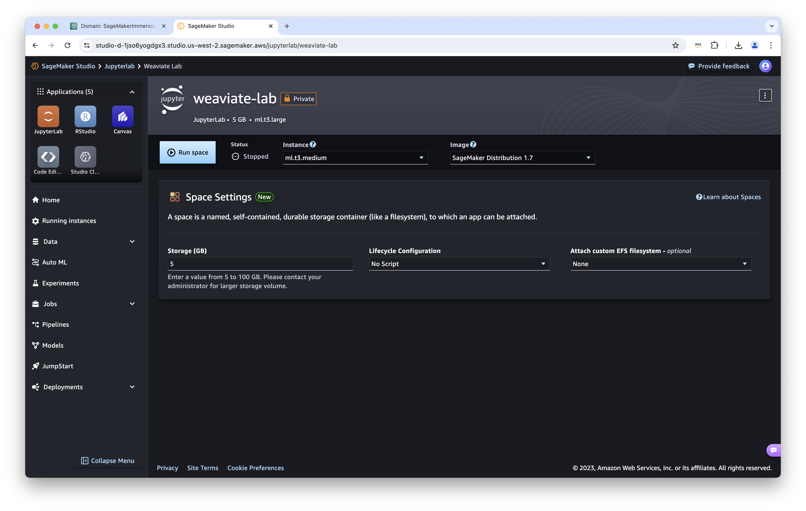

### Select "Open JupyterLab" once it's ready
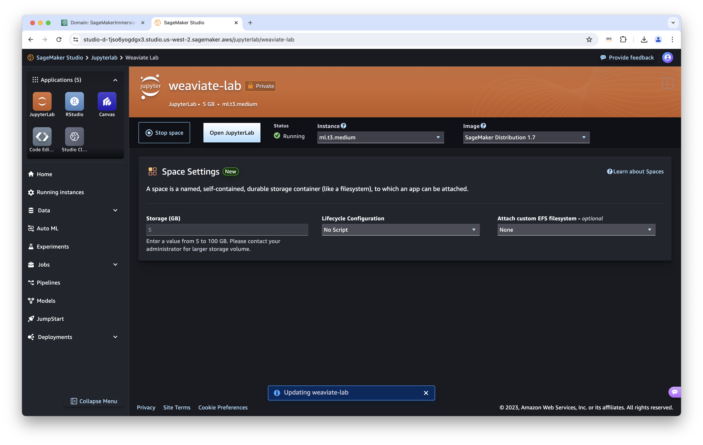

### Open a Terminal (under other)
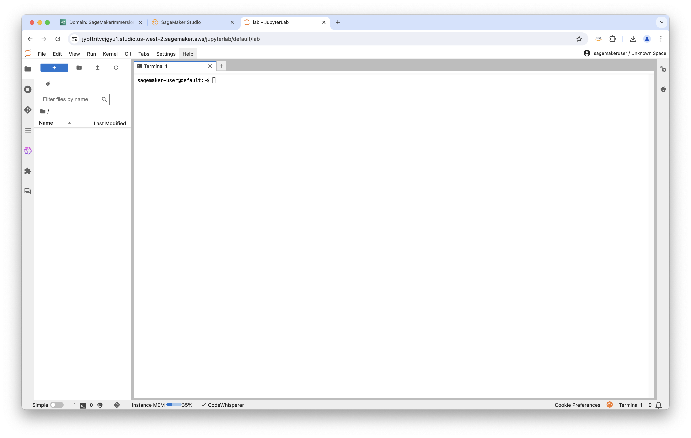

Type the following:

### Clone the workshop repository
```bash
git clone -b aws-immersion https://github.com/weaviate-tutorials/weaviate-workshop
```

### Move to the setup folder
```bash
cd weaviate-workshop/0-setup/
```

### Run the `setup.ipynb` notebook

### Once this executes sucessfully you should be ready to get started!
